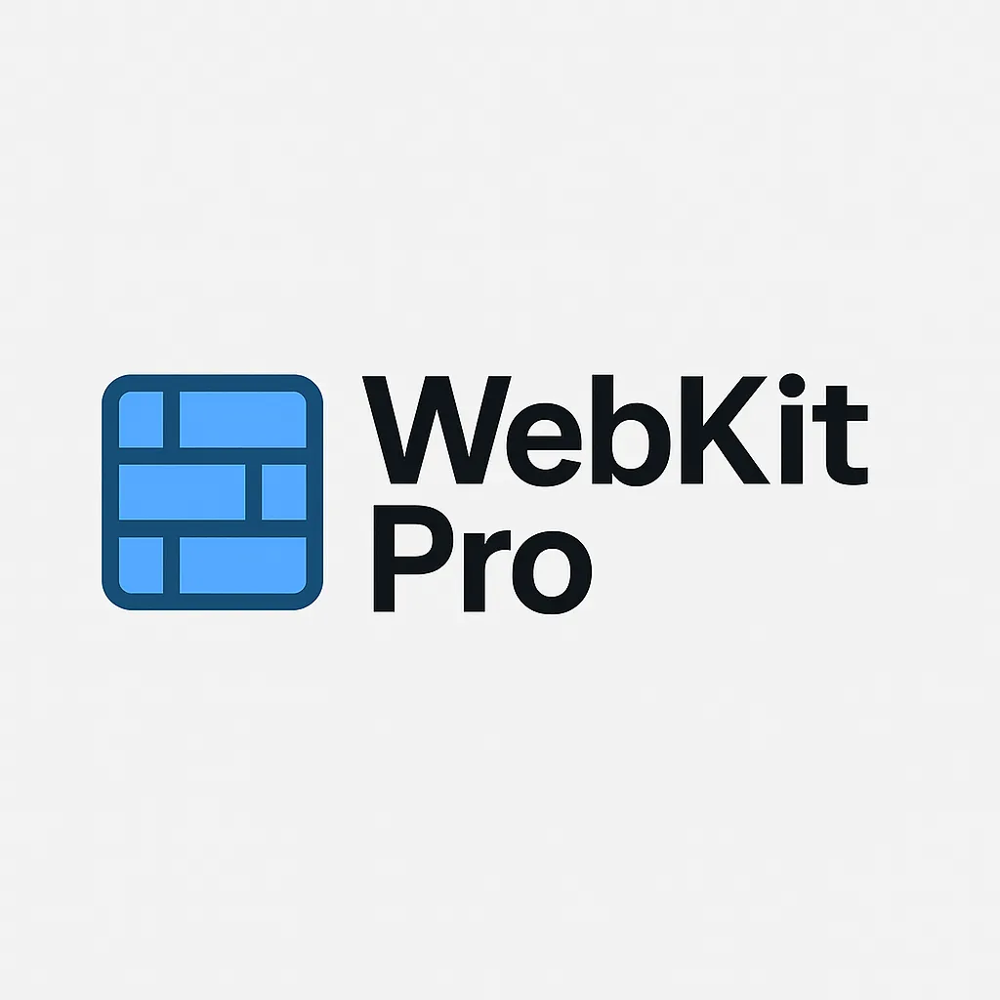

# webkit-pro

**Автор**: Andriy Ovcharov; 
**Ліцензія** MIT License.

**WebKit Pro** — це сучасна бібліотека шаблонів коду, що включає компоненти для побудови веб-інтерфейсів. Вона побудована на основі Bootstrap та Tailwind CSS і дозволяє швидко створювати адаптивні, модульні та ефективні веб-сторінки з готовими шаблонами для найпоширеніших елементів інтерфейсу.

## Особливості

- **Гнучкість**: компоненти можуть використовуватися з будь-якими проєктами, що базуються на Bootstrap або Tailwind.
- **Готові шаблони**: шаблони для header, footer та інших елементів інтерфейсу.
- **Сучасний дизайн**: стильний, адаптивний та легкий у використанні дизайн для різних пристроїв.
- **Модульність**: можна вибирати лише необхідні компоненти для проєкту.

  

