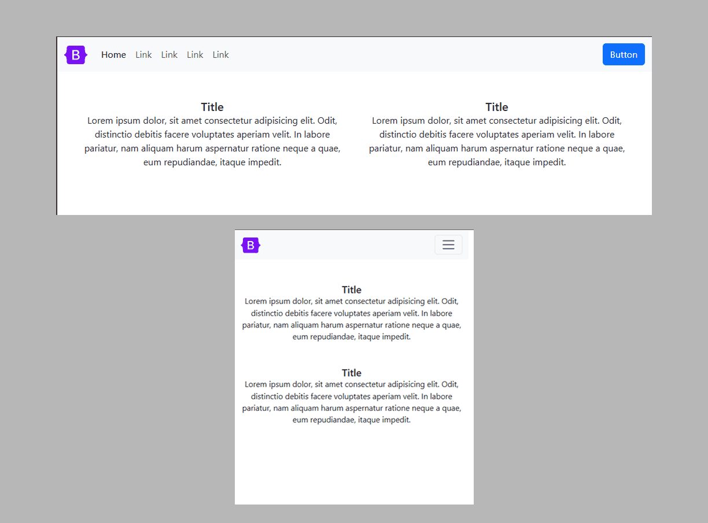
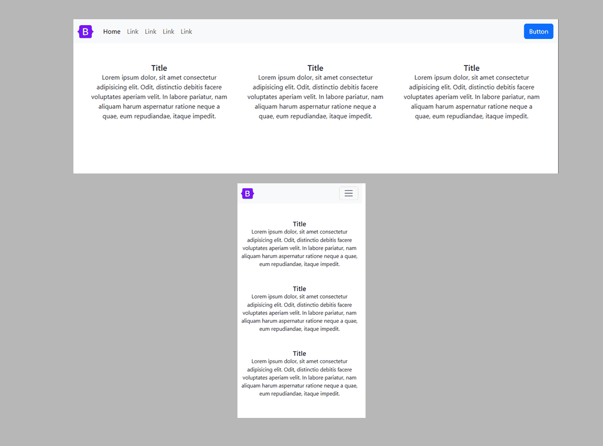
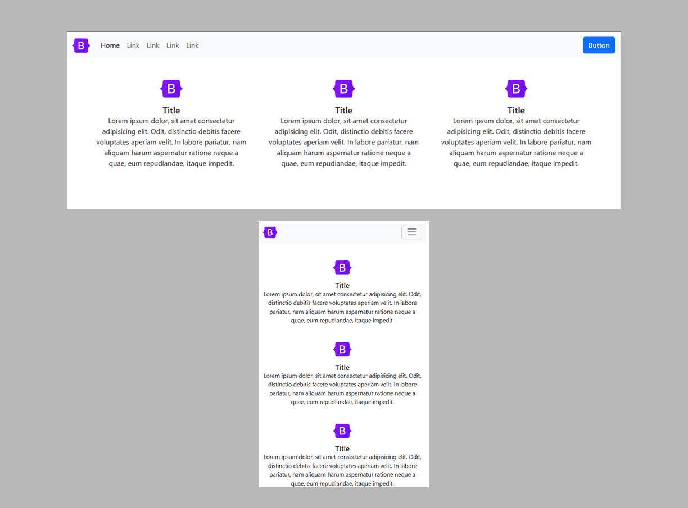
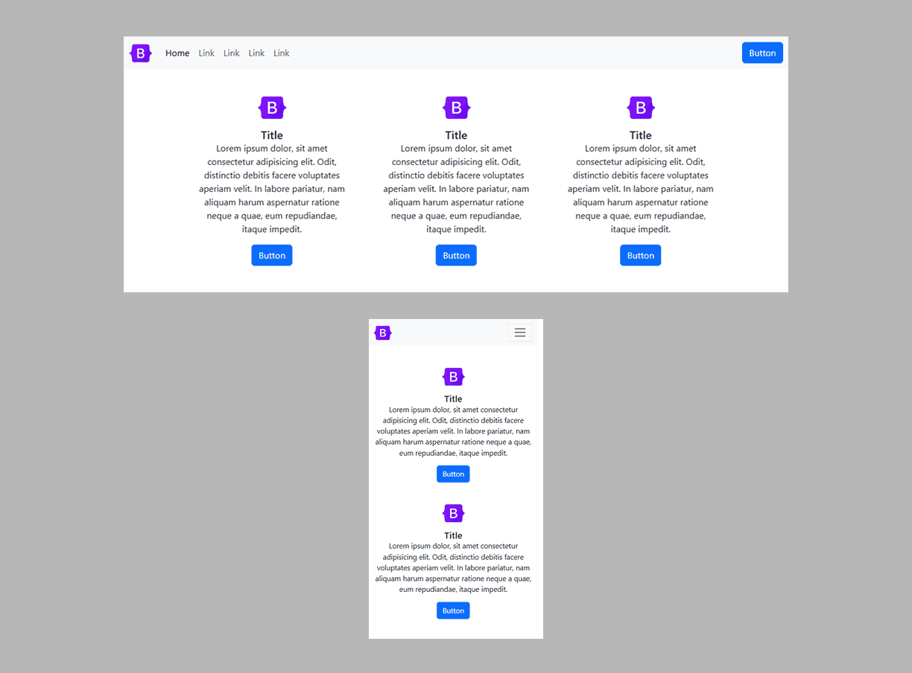
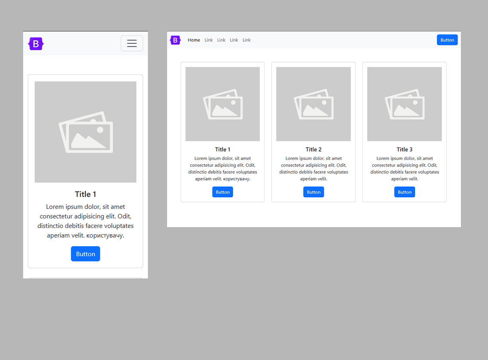
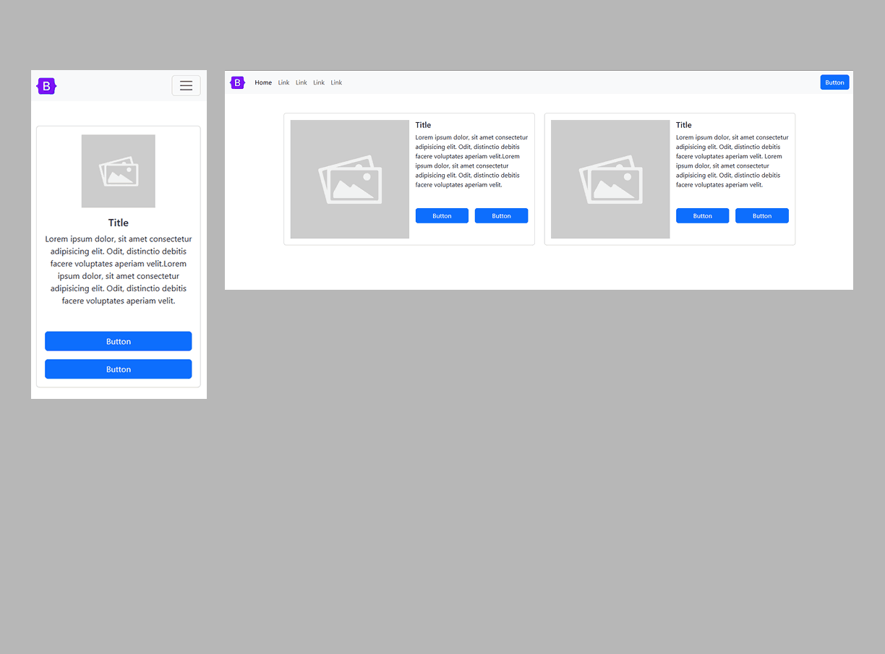
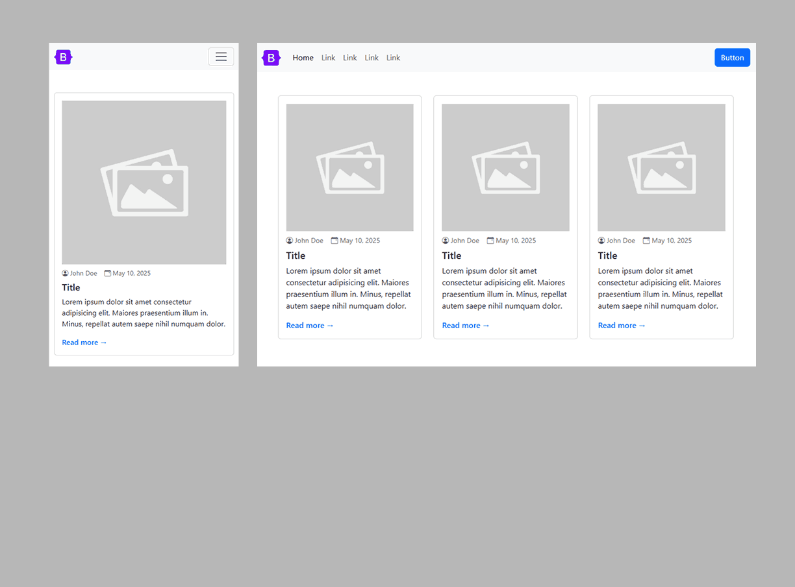
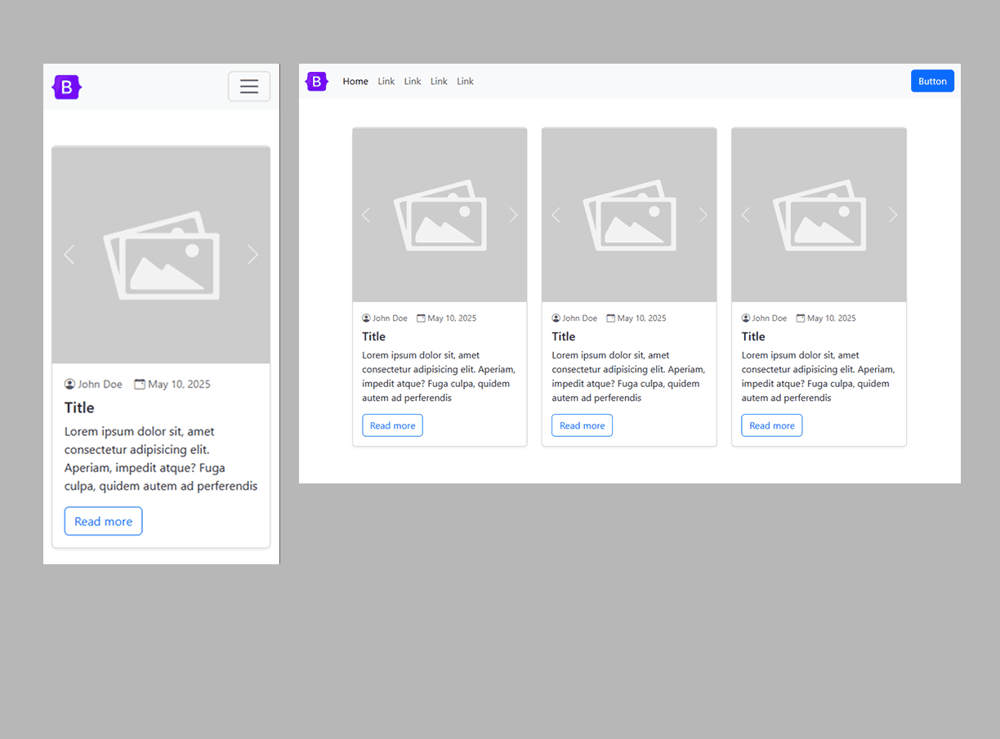
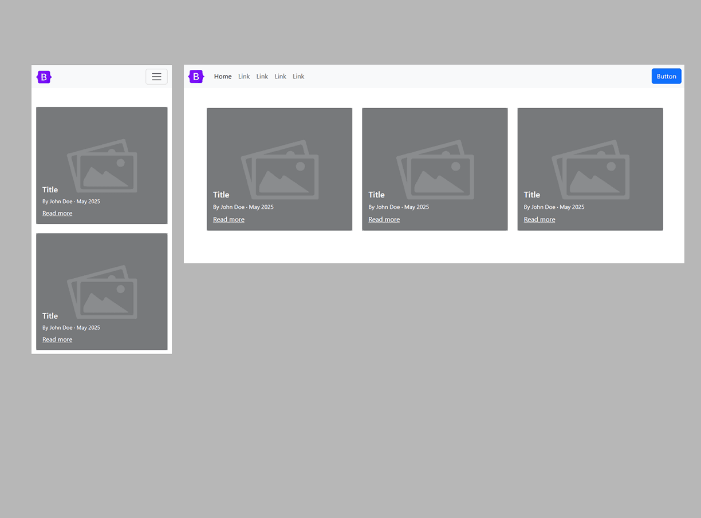
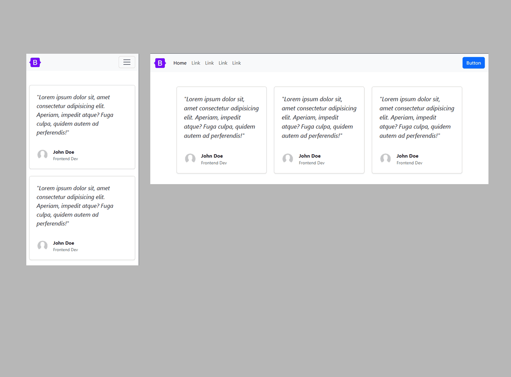

<h3>Bootstrap Card Examples</h3>

| Name         | Description | Preview |
|---------------|------|--------|
| **Card №1** | [Two simple cards with a title and text in the center.](https://github.com/ovcharovcoder/webkit-pro/tree/main/bootstrap/components/cards/card-1) |  |
| **Card №2** | [Three simple cards with a title and text in the center.](https://github.com/ovcharovcoder/webkit-pro/tree/main/bootstrap/components/cards/card-2) |  |
| **Card №3** | [Three simple cards with an icon, title and text in the center.](https://github.com/ovcharovcoder/webkit-pro/tree/main/bootstrap/components/cards/card-3) |  |
| **Card №4** | [Four simple cards with an icon, title and text in the center.](https://github.com/ovcharovcoder/webkit-pro/tree/main/bootstrap/components/cards/card-4) |  |
| **Card №5** | [Three simple cards with an icon, title and text in the center and a button.](https://github.com/ovcharovcoder/webkit-pro/tree/main/bootstrap/components/cards/card-5) |  |
| **Card №6** | [Three simple cards with a border, have an icon, a title and text in the center and a button.](https://github.com/ovcharovcoder/webkit-pro/tree/main/bootstrap/components/cards/card-6) |  |
| **Card №7** | [Three cards with image, text and button.](https://github.com/ovcharovcoder/webkit-pro/tree/main/bootstrap/components/cards/card-7) |  |
| **Card №8** | [Two cards with an image on the left side, text and two buttons.](https://github.com/ovcharovcoder/webkit-pro/tree/main/bootstrap/components/cards/card-8) |  |
| **Card №9** | [Three cards with an image, author, date and text is ideal for a blog.](https://github.com/ovcharovcoder/webkit-pro/tree/main/bootstrap/components/cards/card-9) |  |
| **Card №10** | [Three cards with a carousel, author, date and text for a blog.](https://github.com/ovcharovcoder/webkit-pro/tree/main/bootstrap/components/cards/card-10) |  |
| **Card №11** | [Three cards with the author and text on the background of the image — good for a blog.](https://github.com/ovcharovcoder/webkit-pro/tree/main/bootstrap/components/cards/card-11) |  |
| **Card №12** | [Three cards for customer testimonials.](https://github.com/ovcharovcoder/webkit-pro/tree/main/bootstrap/components/cards/card-12) |  |
