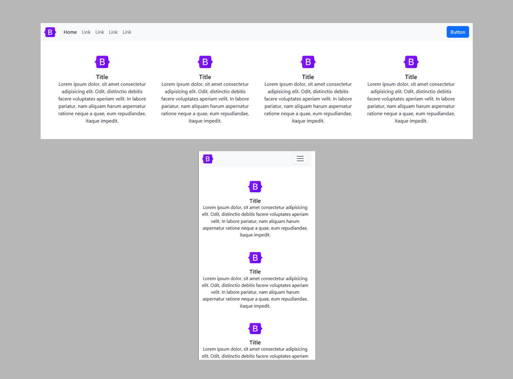

**Footer №1:
<a href="https://github.com/ovcharovcoder/webkit-pro/tree/main/bootstrap/components/cards/card-1">Two simple cards with a title and text in the center.</a>**

 

**Footer №2:
<a href="https://github.com/ovcharovcoder/webkit-pro/tree/main/bootstrap/components/cards/card-2">Three simple cards with a title and text in the center.</a>**

 

**Footer №3:
<a href="https://github.com/ovcharovcoder/webkit-pro/tree/main/bootstrap/components/cards/card-3">Three simple cards with an icon, title and text in the center.</a>**

 

**Footer №4:
<a href="https://github.com/ovcharovcoder/webkit-pro/tree/main/bootstrap/components/cards/card-4">Four simple cards with an icon, title and text in the center.</a>**

 

**Footer №5:
<a href="https://github.com/ovcharovcoder/webkit-pro/tree/main/bootstrap/components/cards/card-5">Three simple cards with an icon, title and text in the center and a button.</a>**

 

**Footer №6:
<a href="https://github.com/ovcharovcoder/webkit-pro/tree/main/bootstrap/components/cards/card-6">Three simple cards with a border, have an icon, a title and text in the center and a button.</a>**

 

**Footer №7:
<a href="https://github.com/ovcharovcoder/webkit-pro/tree/main/bootstrap/components/cards/card-7">Three cards with image, text and button.</a>**

 

**Footer №8:
<a href="https://github.com/ovcharovcoder/webkit-pro/tree/main/bootstrap/components/cards/card-8">Two cards with an image on the left side, text and two buttons.</a>**

 

**Footer №9:
<a href="https://github.com/ovcharovcoder/webkit-pro/tree/main/bootstrap/components/cards/card-9">Three cards with an image, author, date and text is ideal for a blog.</a>**

 

**Footer №10:
<a href="https://github.com/ovcharovcoder/webkit-pro/tree/main/bootstrap/components/cards/card-10">Three cards with an carousel, author, date and text is for a blog.</a>**

 

**Footer №11:
<a href="https://github.com/ovcharovcoder/webkit-pro/tree/main/bootstrap/components/cards/card-11">Three cards with the author and text on the background of the image is good for a blog.</a>**

 

**Footer №12:
<a href="https://github.com/ovcharovcoder/webkit-pro/tree/main/bootstrap/components/cards/card-12">Three cards for customer testimonials.</a>**

 

