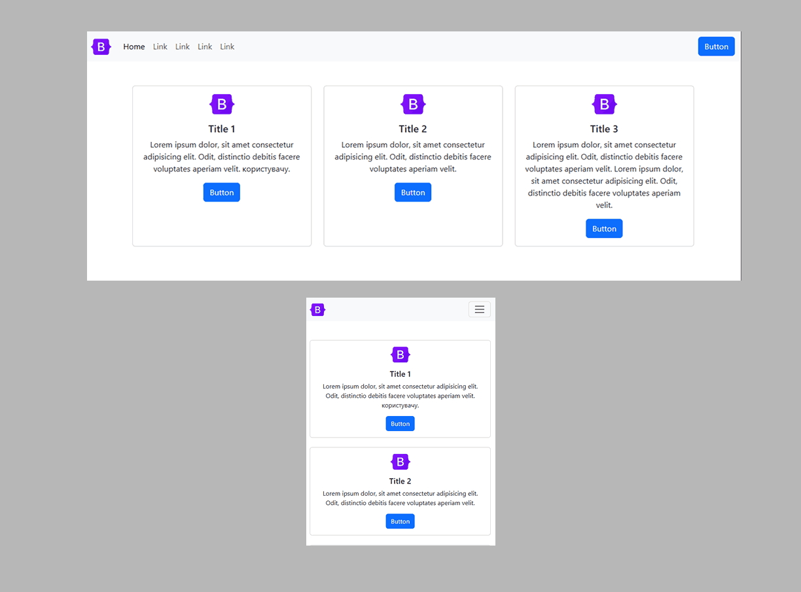

## 📦 Bootstrap Cards — WebKit Pro Components

| №  | Preview | Description |
|----|---------|-------------|
| 1  |  | [Two simple cards with a title and text in the center](https://github.com/ovcharovcoder/webkit-pro/tree/main/bootstrap/components/cards/card-1) |
| 2  |  | [Three simple cards with a title and text in the center](https://github.com/ovcharovcoder/webkit-pro/tree/main/bootstrap/components/cards/card-2) |
| 3  |  | [Three simple cards with an icon, title and text in the center](https://github.com/ovcharovcoder/webkit-pro/tree/main/bootstrap/components/cards/card-3) |
| 4  |  | [Four simple cards with an icon, title and text in the center](https://github.com/ovcharovcoder/webkit-pro/tree/main/bootstrap/components/cards/card-4) |
| 5  |  | [Three simple cards with an icon, title, text and a button](https://github.com/ovcharovcoder/webkit-pro/tree/main/bootstrap/components/cards/card-5) |
| 6  |  | [Three bordered cards with icon, title, text and a button](https://github.com/ovcharovcoder/webkit-pro/tree/main/bootstrap/components/cards/card-6) |
| 7  |  | [Three cards with image, text and button](https://github.com/ovcharovcoder/webkit-pro/tree/main/bootstrap/components/cards/card-7) |
| 8  |  | [Two cards with image on the left, text and two buttons](https://github.com/ovcharovcoder/webkit-pro/tree/main/bootstrap/components/cards/card-8) |
| 9  |  | [Three cards with image, author, date and text — ideal for blogs](https://github.com/ovcharovcoder/webkit-pro/tree/main/bootstrap/components/cards/card-9) |
| 10 |  | [Three cards with carousel, author, date and text — for blogs](https://github.com/ovcharovcoder/webkit-pro/tree/main/bootstrap/components/cards/card-10) |
| 11 |  | [Three cards with author and text over image background](https://github.com/ovcharovcoder/webkit-pro/tree/main/bootstrap/components/cards/card-11) |
| 12 |  | [Three cards for customer testimonials](https://github.com/ovcharovcoder/webkit-pro/tree/main/bootstrap/components/cards/card-12) |
