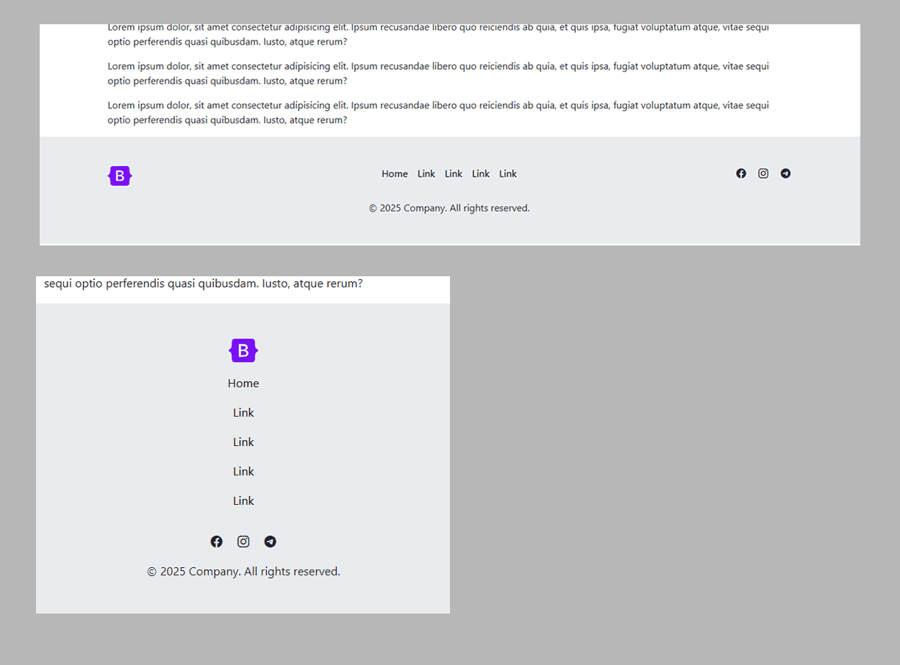
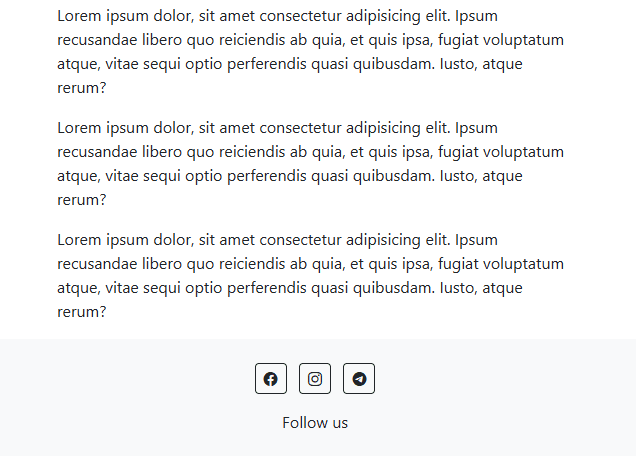

**Footer №1:
<a href="https://github.com/ovcharovcoder/webkit-pro/tree/main/bootstrap/components/footers/footer-1">Simple footer with social media in the center.</a>**

 

**Footer №2:
<a href="https://github.com/ovcharovcoder/webkit-pro/tree/main/bootstrap/components/footers/footer-2">Footer with centered menu.</a>**

 

**Footer №3:
<a href="https://github.com/ovcharovcoder/webkit-pro/tree/main/bootstrap/components/footers/footer-3">Footer with centered menu in two columns.</a>**

 

**Footer №4:
<a href="https://github.com/ovcharovcoder/webkit-pro/tree/main/bootstrap/components/footers/footer-4">Footer with centered menu in two columns and icons.</a>**

 

**Footer №5:
<a href="https://github.com/ovcharovcoder/webkit-pro/tree/main/bootstrap/components/footers/footer-5">Simple footer with centered menu.</a>**

 

**Footer №6:
<a href="https://github.com/ovcharovcoder/webkit-pro/tree/main/bootstrap/components/footers/footer-6">Footer with form</a>**

 

**Footer №7:
<a href="https://github.com/ovcharovcoder/webkit-pro/tree/main/bootstrap/components/footers/footer-7">Simple footer with centered menu</a>**

 

**Footer №8:
<a href="https://github.com/ovcharovcoder/webkit-pro/tree/main/bootstrap/components/footers/footer-8">Creative Footer with icons</a>**

 

**Footer №9:
<a href="https://github.com/ovcharovcoder/webkit-pro/tree/main/bootstrap/components/footers/footer-9">Simple footer with icons in the center</a>**

 

**Footer №10:
<a href="https://github.com/ovcharovcoder/webkit-pro/tree/main/bootstrap/components/footers/footer-10">Simple footer with centered menu</a>**

 
