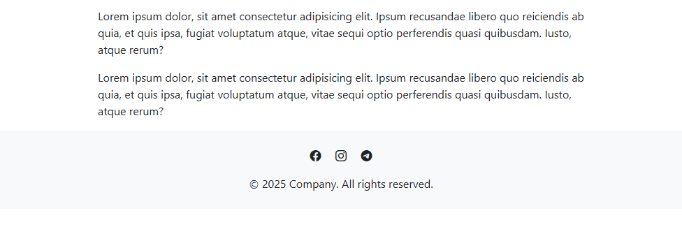
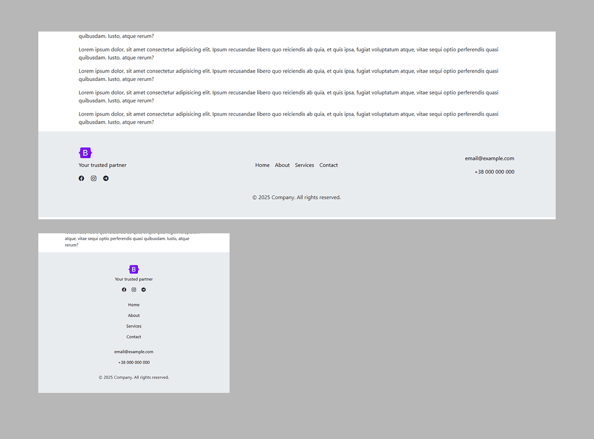

**Footer №1:
<a href="https://github.com/ovcharovcoder/webkit-pro/tree/main/bootstrap/components/footers/footer-1">Simple footer with social media in the center.</a>**

 

**Footer №2:
Simple footer with centered menu.**

 

**Footer №3:
Simple footer with centered menu.**

 
