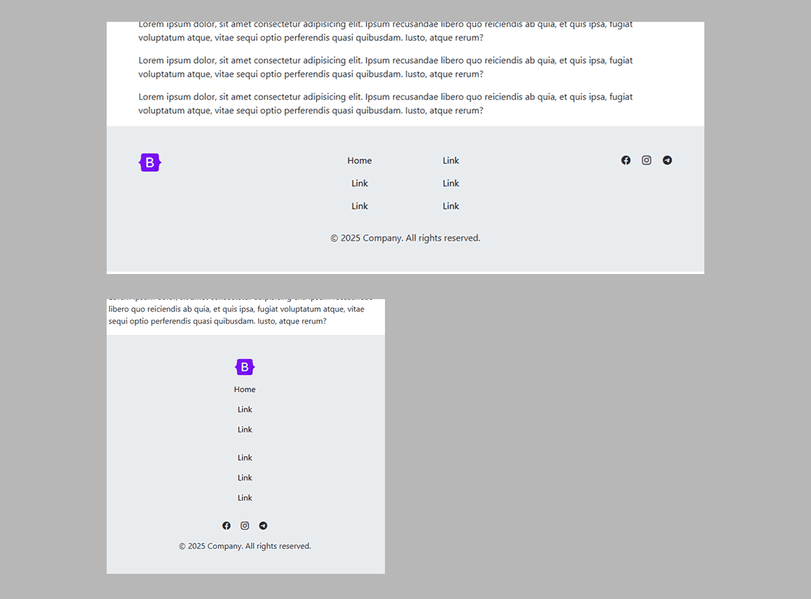

## 📦 Bootstrap Footers — WebKit Pro Components

| № | Preview | Description |
|--:|:--------|:------------|
| **1** |  | [Simple footer with social media in the center.](https://github.com/ovcharovcoder/webkit-pro/tree/main/bootstrap/components/footers/footer-1) |
| **2** |  | [Footer with centered menu.](https://github.com/ovcharovcoder/webkit-pro/tree/main/bootstrap/components/footers/footer-2) |
| **3** |  | [Footer with centered menu in two columns.](https://github.com/ovcharovcoder/webkit-pro/tree/main/bootstrap/components/footers/footer-3) |
| **4** |  | [Footer with centered menu in two columns and icons.](https://github.com/ovcharovcoder/webkit-pro/tree/main/bootstrap/components/footers/footer-4) |
| **5** |  | [Simple footer with centered menu.](https://github.com/ovcharovcoder/webkit-pro/tree/main/bootstrap/components/footers/footer-5) |
| **6** |  | [Footer with form.](https://github.com/ovcharovcoder/webkit-pro/tree/main/bootstrap/components/footers/footer-6) |
| **7** |  | [Simple footer with centered menu.](https://github.com/ovcharovcoder/webkit-pro/tree/main/bootstrap/components/footers/footer-7) |
| **8** |  | [Creative Footer with icons.](https://github.com/ovcharovcoder/webkit-pro/tree/main/bootstrap/components/footers/footer-8) |
| **9** |  | [Simple footer with icons in the center.](https://github.com/ovcharovcoder/webkit-pro/tree/main/bootstrap/components/footers/footer-9) |
| **10** |  | [Simple footer with centered menu.](https://github.com/ovcharovcoder/webkit-pro/tree/main/bootstrap/components/footers/footer-10) |
