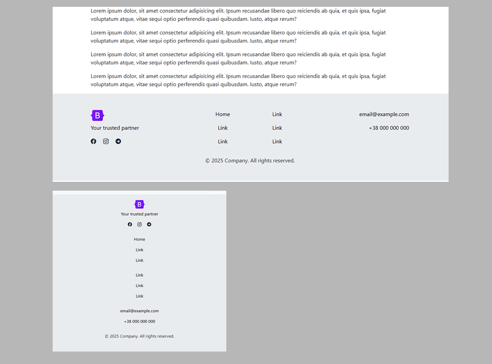

**Footer with centered menu in two columns.**

This footer includes a company logo with a slogan, social media icons (Facebook, Instagram, Telegram), two separate link columns for quick navigation, and full contact information (email and phone number). It ends with a copyright notice. This layout is ideal for corporate websites, service providers, portfolios, and business platforms that require a clean and informative footer structure.

