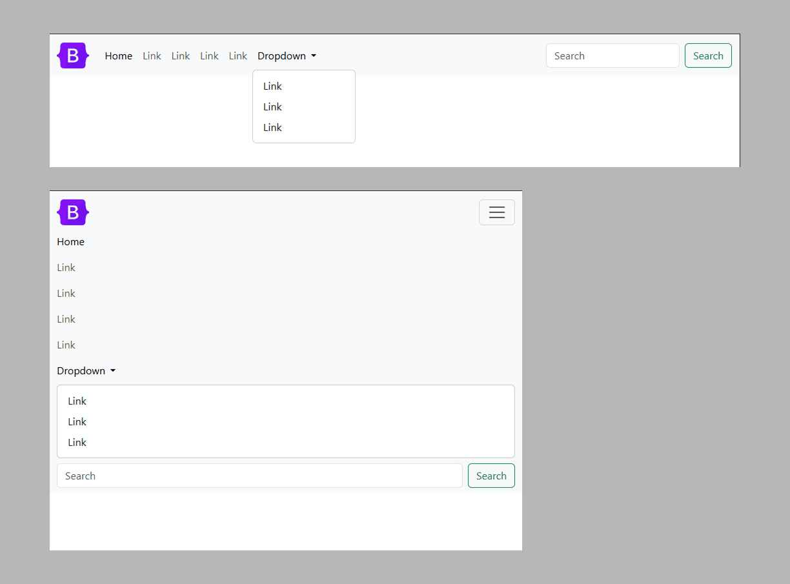
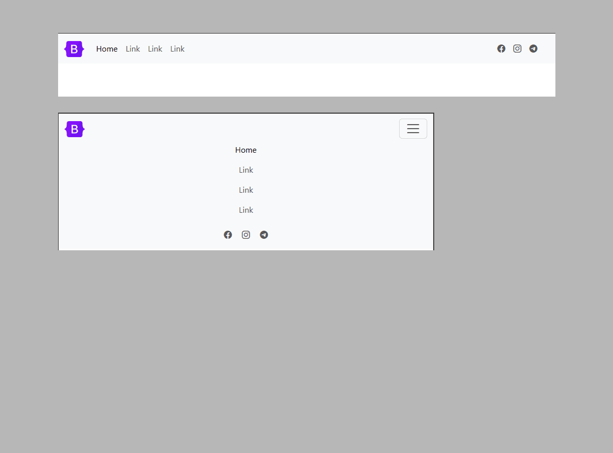

<nav class="text-sm text-gray-600 dark:text-gray-400 flex items-center space-x-1" aria-label="Breadcrumb">
  <a href="#" class="hover:underline hover:text-blue-600 dark:hover:text-blue-400">Home</a>
  <svg xmlns="http://www.w3.org/2000/svg" class="h-3 w-3 text-gray-400" viewBox="0 0 20 20" fill="currentColor">
    <path fill-rule="evenodd" d="M7.293 14.707a1 1 0 010-1.414L10.586 10 7.293 6.707a1 1 0 111.414-1.414l4 4a1 1 0 010 1.414l-4 4a1 1 0 01-1.414 0z" clip-rule="evenodd" />
  </svg>
  <a href="#" class="hover:underline hover:text-blue-600 dark:hover:text-blue-400">Projects</a>
  <svg xmlns="http://www.w3.org/2000/svg" class="h-3 w-3 text-gray-400" viewBox="0 0 20 20" fill="currentColor">
    <path fill-rule="evenodd" d="M7.293 14.707a1 1 0 010-1.414L10.586 10 7.293 6.707a1 1 0 111.414-1.414l4 4a1 1 0 010 1.414l-4 4a1 1 0 01-1.414 0z" clip-rule="evenodd" />
  </svg>
  <a href="#" class="hover:underline hover:text-blue-600 dark:hover:text-blue-400">webkit-pro</a>
  <svg xmlns="http://www.w3.org/2000/svg" class="h-3 w-3 text-gray-400" viewBox="0 0 20 20" fill="currentColor">
    <path fill-rule="evenodd" d="M7.293 14.707a1 1 0 010-1.414L10.586 10 7.293 6.707a1 1 0 111.414-1.414l4 4a1 1 0 010 1.414l-4 4a1 1 0 01-1.414 0z" clip-rule="evenodd" />
  </svg>
  Breadcrumbs
</nav>

## Bootstrap Headers — WebKit Pro Components

| №  | Preview | Description |
|----|---------|-------------|
| 1  |  | [Navigation menu with a form and a drop-down list](https://github.com/ovcharovcoder/webkit-pro/tree/main/bootstrap/components/headers/header-1) |
| 2  |  | [Navigation menu with drop-down list and button](https://github.com/ovcharovcoder/webkit-pro/tree/main/bootstrap/components/headers/header-2) |
| 3  |  | [Navigation menu with button](https://github.com/ovcharovcoder/webkit-pro/tree/main/bootstrap/components/headers/header-3) |
| 4  |  | [Navigation menu with a button and a list in the center](https://github.com/ovcharovcoder/webkit-pro/tree/main/bootstrap/components/headers/header-4) |
| 5  |  | [Navigation menu with logo in the center](https://github.com/ovcharovcoder/webkit-pro/tree/main/bootstrap/components/headers/header-5) |
| 6  |  | [The navigation menu that appears on the right contains a form and a drop-down list](https://github.com/ovcharovcoder/webkit-pro/tree/main/bootstrap/components/headers/header-6) |
| 7  |  | [Navigation menu that opens down](https://github.com/ovcharovcoder/webkit-pro/tree/main/bootstrap/components/headers/header-7) |
| 8  |  | [Navigation menu with language bar](https://github.com/ovcharovcoder/webkit-pro/tree/main/bootstrap/components/headers/header-8) |
| 9  |  | [Navigation menu with social networks](https://github.com/ovcharovcoder/webkit-pro/tree/main/bootstrap/components/headers/header-9) |
| 10 |  | [Navigation menu with social networks](https://github.com/ovcharovcoder/webkit-pro/tree/main/bootstrap/components/headers/header-10) |
