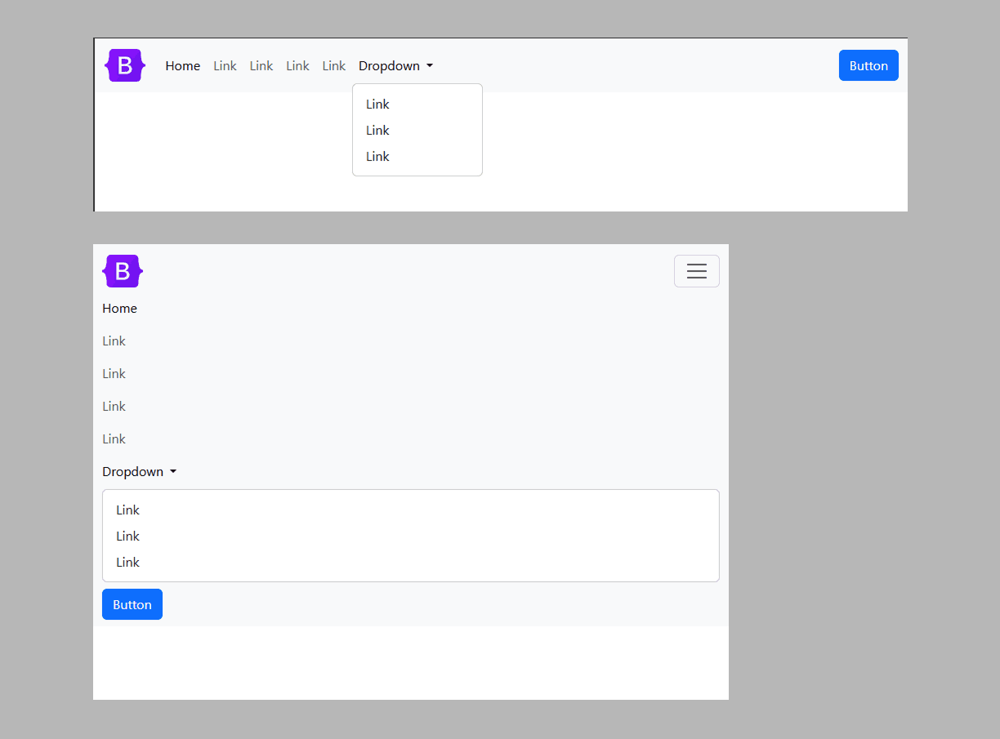
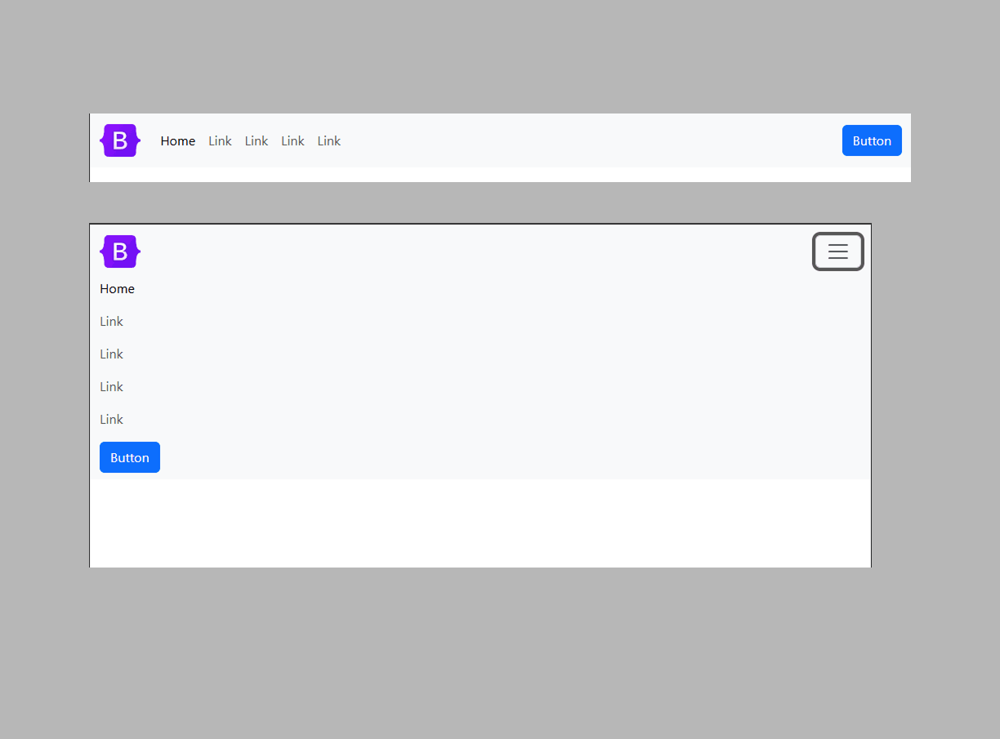
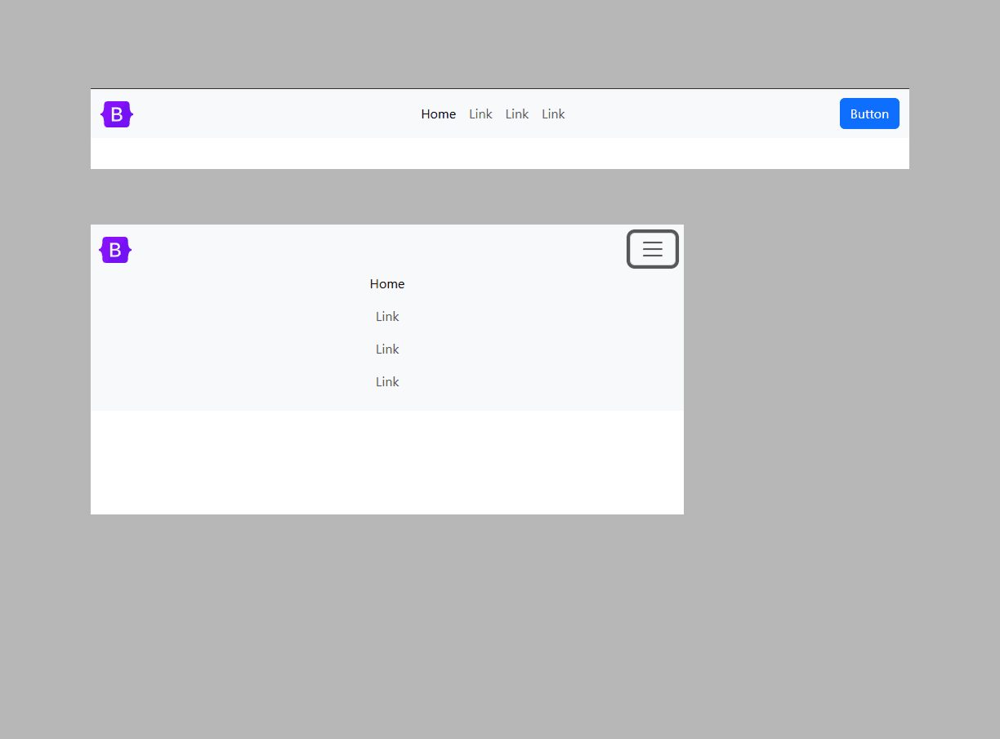
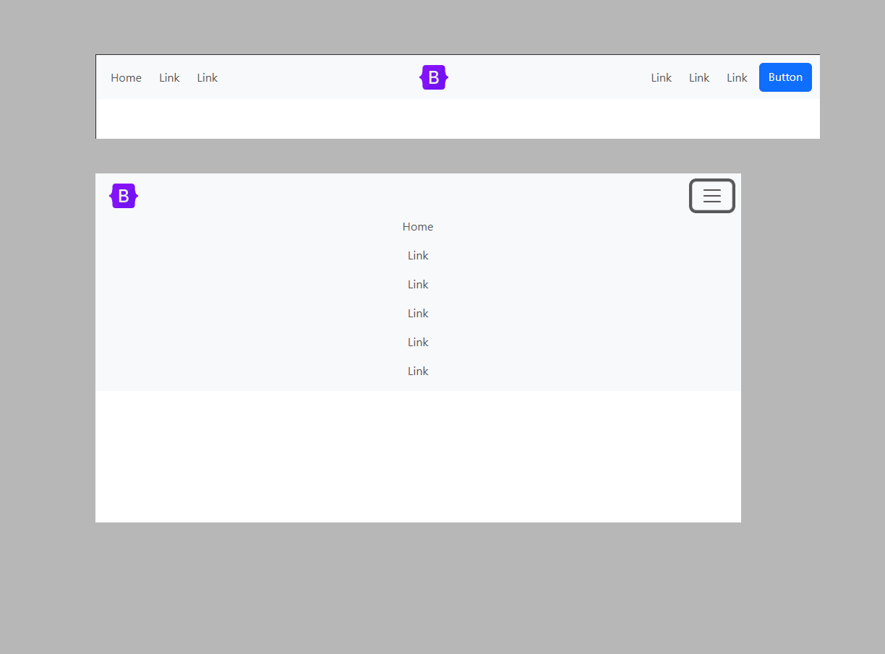
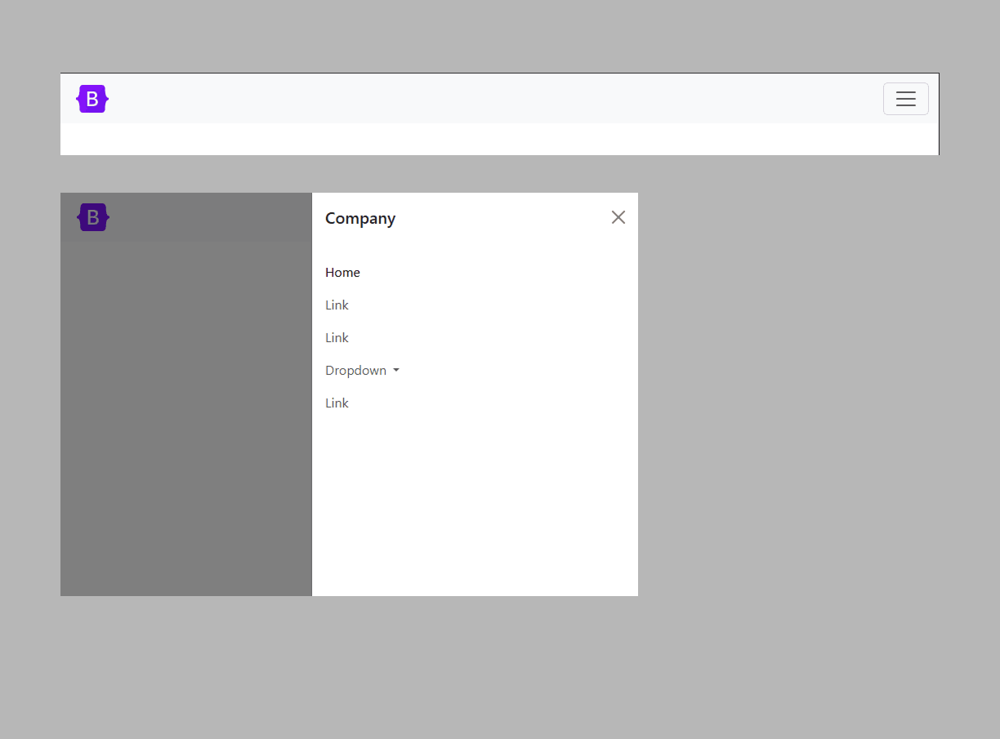
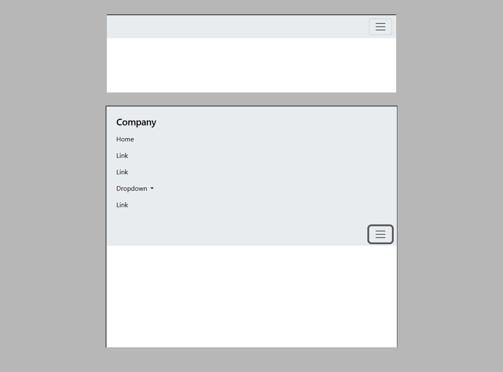
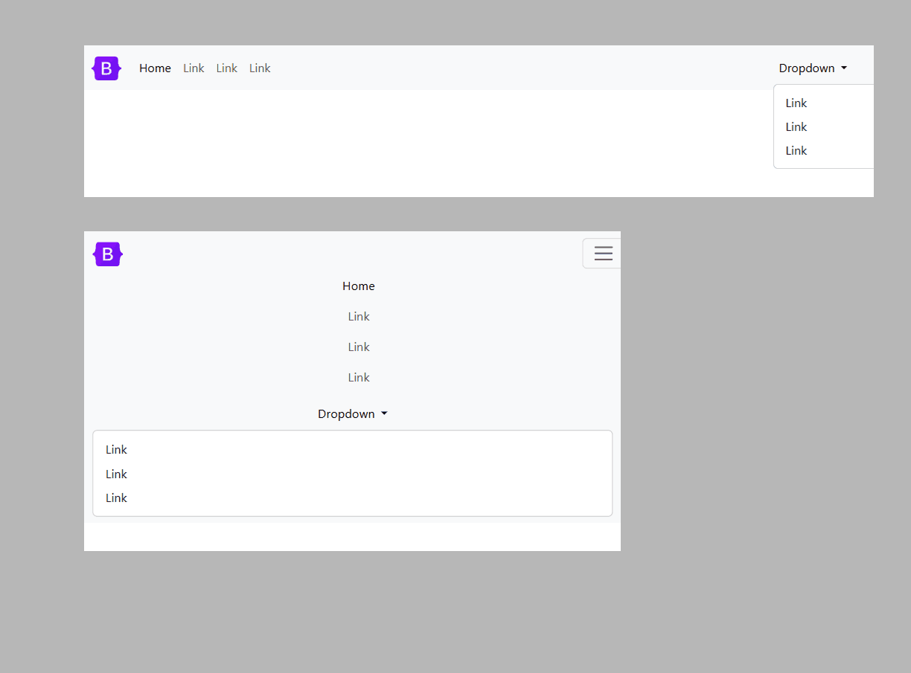
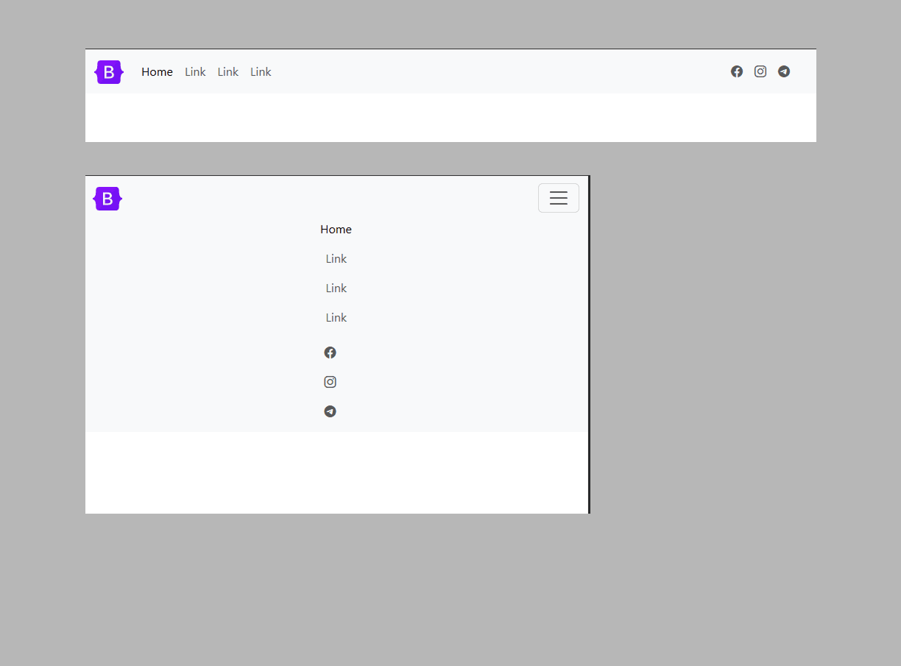
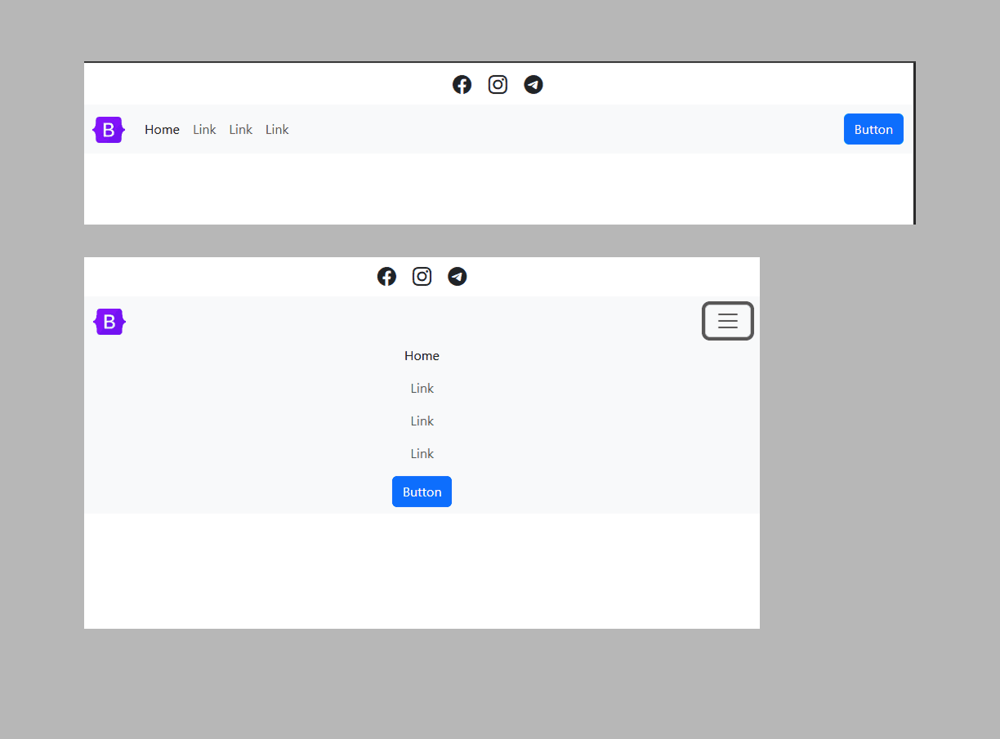

**Header №1:
<a href="https://github.com/ovcharovcoder/webkit-pro/tree/main/bootstrap/components/headers/header-1">Simple header with social media in the center.</a>**

 

**Header №2:
<a href="https://github.com/ovcharovcoder/webkit-pro/tree/main/bootstrap/components/headers/header-2">header with centered menu.</a>**

 

**Header №3:
<a href="https://github.com/ovcharovcoder/webkit-pro/tree/main/bootstrap/components/headers/header-3">header with centered menu in two columns.</a>**

 

**Header №4:
<a href="https://github.com/ovcharovcoder/webkit-pro/tree/main/bootstrap/components/headers/header-4">header with centered menu in two columns and icons.</a>**

 

**Header №5:
<a href="https://github.com/ovcharovcoder/webkit-pro/tree/main/bootstrap/components/headers/header-5">Simple header with centered menu.</a>**

 

**Header №6:
<a href="https://github.com/ovcharovcoder/webkit-pro/tree/main/bootstrap/components/headers/header-6">header with form</a>**

 

**Header №7:
<a href="https://github.com/ovcharovcoder/webkit-pro/tree/main/bootstrap/components/headers/header-7">Simple header with centered menu</a>**

 

**Header №8:
<a href="https://github.com/ovcharovcoder/webkit-pro/tree/main/bootstrap/components/headers/header-8">Creative header with icons</a>**

 

**Header №9:
<a href="https://github.com/ovcharovcoder/webkit-pro/tree/main/bootstrap/components/headers/header-9">Simple header with icons in the center</a>**

 

**Header №10:
<a href="https://github.com/ovcharovcoder/webkit-pro/tree/main/bootstrap/components/headers/header-10">Simple header with centered menu</a>**

 
